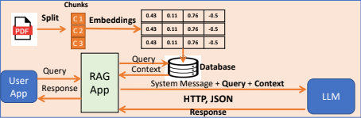

# 📚 RAG - Retrieval Augmented Generation

Une application web intelligente de **Retrieval Augmented Generation (RAG)** qui combine la puissance des modèles d'IA avec vos documents personnels pour des réponses précises et contextualisées.

---

## 🎯 Vue d'ensemble du projet

Cette application permet de :
- 📄 **Charger** vos documents PDF
- 🔄 **Traiter** le contenu avec un chunking intelligent
- 🧠 **Créer** une base de données vectorielle avec des embeddings
- 💬 **Poser** des questions et obtenir des réponses basées sur vos documents
- ⚡ **Utiliser** GPT-4o pour des réponses précises et contextuelles

---

## 📓 Notebook RAGV2 - Guide Complet

Le notebook **RAGV2.ipynb** est un guide interactif et pédagogique qui explore en profondeur les concepts et l'implémentation de RAG. Il contient des explications théoriques, des exemples pratiques et une évaluation complète.

### **Sections principales du notebook**

#### 1️⃣ **The Building Blocks of RAG**
- Vue d'ensemble du workflow RAG
- Comprendre les trois étapes clés :
  - **Indexation** : Création de la base de données vectorielle
  - **Retrieval** : Récupération des documents pertinents
  - **Generation** : Génération des réponses avec LLM

#### 2️⃣ **Step 1: Creating a Vector Database (Indexing)**
- **Choosing an embedding model** : Sélection de `text-embedding-3-small`
- **Chunking documents** : Stratégies de découpage optimal
  - Recursive Character Text Splitter
  - Gestion du chunk_size et chunk_overlap
  - Encodage Tiktoken pour compatibilité GPT

#### 3️⃣ **Step 2: Querying the Vector Database**
- Techniques de recherche sémantique
- Similarité cosinus et matching
- Paramètre k pour les top résultats

#### 4️⃣ **Implémentation Pratique**

**1 - Loading the PDF, Chunking**
```python
from langchain_community.document_loaders import PyPDFLoader
loader = PyPDFLoader("document.pdf")
documents = loader.load()
chunks = text_splitter.split_documents(documents)
```

**2 - Vector Store - ChromaDB, Embeddings**
```python
embedding_model = OpenAIEmbeddings(model="text-embedding-3-small")
vectorstore = Chroma.from_documents(
    documents=chunks,
    embedding=embedding_model,
    collection_name="my_collection"
)
```

**3 - RAG Q&A**
- **Prompt Design** : Structuration optimale des prompts
- **Retrieving Relevant Documents** : Stratégies de récupération
- **Defining the RAG Function** : Pipeline complet de réponse

**Exemple de fonction RAG** :
```python
def rag_response(query):
    # 1. Récupérer les documents pertinents
    context_docs = retriever.invoke(query)
    
    # 2. Formater le contexte
    context_text = ". ".join([d.page_content for d in context_docs])
    
    # 3. Construire le prompt
    prompt = prompt_template.format(context=context_text, input=query)
    
    # 4. Générer la réponse
    response = llm.invoke(prompt)
    
    return response.content
```

#### 5️⃣ **Step 4: Evaluation**
- Métriques d'évaluation de qualité
- Vérification de la pertinence des réponses
- Analyse du grounding (fondement sur le contexte)
- Détection et minimisation des hallucinations

---

## 🏗️ Architecture du système

```
┌─────────────────┐
│   Utilisateur   │
│   (Interface)   │
└────────┬────────┘
         │
    ┌────▼─────────────────────────────────┐
    │    Application Streamlit             │
    │  (Interface utilisateur + Chat)      │
    └────────┬─────────────────────────────┘
             │
    ┌────────┼─────────────────────────────┐
    │        │                             │
    ▼        ▼                             ▼
┌────────┐ ┌──────────┐         ┌─────────────────┐
│  PDFs  │ │ Text     │  ──►    │ Text Splitting  │
│        │ │Extraction│         │ (RecursiveChar  │
└────────┘ └──────────┘         │   Splitter)     │
                                └────────┬────────┘
                                         │
                                ┌────────▼────────┐
                                │  Embeddings     │
                                │ OpenAI          │
                                │ (text-embedding-│
                                │  3-small)       │
                                └────────┬────────┘
                                         │
                                ┌────────▼────────┐
                                │ Vector Store    │
                                │ (ChromaDB)      │
                                └────────┬────────┘
                                         │
                        ┌────────────────┼────────────────┐
                        │                │                │
                        ▼                ▼                ▼
                    ┌────────┐      ┌────────┐      ┌────────┐
                    │ Query  │      │ Context│      │ Prompt │
                    │        │      │ Search │      │Builder │
                    └────────┘      └────────┘      └────┬───┘
                                                         │
                                              ┌──────────▼──────────┐
                                              │  GPT-4o             │
                                              │  (LLM)              │
                                              └──────────┬──────────┘
                                                         │
                                              ┌──────────▼──────────┐
                                              │  Réponse finale     │
                                              │  à l'utilisateur    │
                                              └─────────────────────┘
```

---

## 🖼️ Diagramme du flux RAG



---

## 📋 Dépendances

| Paquet | Version | Utilité |
|--------|---------|---------|
| **streamlit** | ≥1.57.0 | Framework web pour l'interface |
| **langchain** | ≥1.3.0 | Framework pour les applications LLM |
| **langchain-openai** | ≥1.2.1 | Intégration OpenAI (embeddings + LLM) |
| **langchain-text-splitters** | ≥1.1.2 | Chunking intelligent du texte |
| **chromadb** | ≥1.5.9 | Base de données vectorielle |
| **pypdf2** | ≥3.0.1 | Extraction de texte depuis les PDFs |
| **python-dotenv** | ≥1.2.2 | Gestion des variables d'environnement |

---

## 🚀 Installation

### Prérequis
- Python 3.13+
- Une clé API OpenAI valide

### Étapes d'installation

1. **Cloner le répertoire** (ou naviguer vers le dossier)
   ```bash
   cd RAG
   ```

2. **Créer un environnement virtuel**
   ```bash
   python -m venv .venv
   ```

3. **Activer l'environnement virtuel**
   - Sur Windows :
     ```bash
     .venv\Scripts\activate
     ```
   - Sur Linux/Mac :
     ```bash
     source .venv/bin/activate
     ```

4. **Installer les dépendances**
   
   ```bash
   uv install   # utilise `uv` pour installer les dépendances depuis pyproject.toml
   ```
   ou
   ```bash
   pip install -r requirements.txt
   ```

   Remarque : le projet fournit `pyproject.toml`. Si vous préférez un autre outil, adaptez la méthode d'installation (ex. `pip install -r requirements.txt`, `poetry install`).

5. **Configurer les variables d'environnement**
   
   Créer un fichier `.env` à la racine du projet :
   ```
   OPENAI_API_KEY=sk-xxxxxxxxxxxxx
   ```

---

## 💻 Utilisation

### Option 1 : Application Streamlit (Interface Web)

```bash
streamlit run rag.py
```

L'application s'ouvrira automatiquement dans votre navigateur à `http://localhost:8501`

### Option 2 : Notebook RAGV2 (Développement & Apprentissage)

```bash
jupyter notebook RAGV2.ipynb
```

Le notebook permet de :
- 📚 **Apprendre** les concepts théoriques de RAG pas à pas
- 🔬 **Expérimenter** avec différents paramètres
- 📊 **Visualiser** les étapes du processus
- ✅ **Évaluer** la qualité des réponses
- 🧪 **Déboguer** le pipeline RAG

### Mode d'emploi

1. **Charger des documents** 📄
   - Cliquez sur "Load your pdfs" dans la barre latérale
   - Sélectionnez un ou plusieurs fichiers PDF
   - Cliquez sur "Submit" pour traiter les documents

2. **Attendre le traitement** ⏳
   - L'application crée les embeddings et remplit la base de données vectorielle
   - Les chunks seront affichés pour vérification

3. **Poser vos questions** 💬
   - Tapez votre question dans le champ "Ask Your Question"
   - L'application recherchera les chunks pertinents
   - GPT-4o générera une réponse basée sur votre contexte

---

## 📊 Comparatif : Streamlit vs Notebook RAGV2

| Aspect | Streamlit (rag.py) | Notebook RAGV2 |
|--------|-------------------|----------------|
| **Interface** | Web interactive | Jupyter Notebook |
| **Utilisation** | Production, utilisateurs finaux | Développement, apprentissage |
| **Interactivité** | UI simple et intuitif | Contrôle complet du code |
| **Visualisation** | Basique | Détaillée et exploratoire |
| **Évaluation** | Non incluse | Complète avec métriques |
| **Flexibilité** | Limitée | Très flexible |
| **Courbe d'apprentissage** | Faible | Moyenne |
| **Performance** | Optimisée pour production | Optimisée pour l'expérimentation |


## ✅ Évaluation et Qualité des Réponses

Le notebook RAGV2 inclut des métriques d'évaluation pour mesurer la qualité du système RAG :

### Métriques clés

1. **Pertinence des documents récupérés** 🎯
   - Vérification que les chunks retournés sont réellement pertinents
   - Score de similarité avec la requête

2. **Grounding (Fondement de la réponse)** 📌
   - Vérification que la réponse est basée sur le contexte fourni
   - Détection des hallucinations (réponses non fondées)

3. **Complétude** 📋
   - Les réponses couvrent-elles tous les aspects de la question ?

4. **Exactitude** ✔️
   - Les informations fournies sont-elles correctes selon les documents ?

### Utilisation de Groundedness Checker

Le notebook implémente un système de vérification du fondement utilisant un LLM secondaire :

```python
groundedness_rater_system_message = """
You are a evaluator that grades the groundedness of a LLM generated 
response given a context. A response is grounded if it is directly 
supported by information in the context.
"""

# Évaluation automatique des réponses
groundedness_score = groundness_checker.evaluate(response, context)
```

---

## 📂 Structure du projet

```
RAG/
├── rag.py                 # Application Streamlit principale
├── main.py                # Point d'entrée (optionnel)
├── RAGV2.ipynb            # Notebook Jupyter pour développement
├── pyproject.toml         # Configuration du projet
├── README.md              # Ce fichier
├── rag.png                # Logo/Diagramme RAG
├── .env                   # Variables d'environnement (à créer)
├── .venv/                 # Environnement virtuel
├── pdfs/                  # Dossier de stockage des PDFs
└── store/                 # Base de données ChromaDB
    ├── chroma.sqlite3
    └── b0f716e7.../
```

---

## 🔑 Fonctionnement technique

### 1. **Extraction de texte** 📖
```python
reader = PdfReader(pdf)
content = page.extract_text()
```

### 2. **Chunking intelligent** ✂️
Utilise `RecursiveCharacterTextSplitter` avec :
- **Chunk size** : 1024 caractères
- **Overlap** : 64 caractères
- **Encodage** : Tiktoken (compatible avec GPT)

### 3. **Embeddings** 🧠
- Modèle : `text-embedding-3-small` (OpenAI)
- Rapidité et efficacité optimales

### 4. **Recherche vectorielle** 🔍
- Base de données : ChromaDB
- Paramètre k : 5 documents les plus pertinents
- Similarité cosinus pour le matching

### 5. **Génération de réponses** 💡
- Modèle : `gpt-4o`
- Température : 0 (réponses déterministes)
- Prompt template personnalisé avec contexte

---

## 🎓 Leçons apprises du notebook RAGV2

À travers l'implémentation complète du notebook, plusieurs bonnes pratiques essentielles ont été identifiées :

### 1. **Stratégies de Chunking** ✂️
- La taille des chunks impacte directement la qualité des réponses
- Un overlap (chevauchement) permet une meilleure continuité contextuelle
- `RecursiveCharacterTextSplitter` adaptée pour la plupart des cas

### 2. **Sélection des Embeddings** 🧠
- `text-embedding-3-small` : Bon équilibre coût/performance
- Les embeddings sont stockés localement pour éviter les appels répétés
- La qualité des embeddings = qualité de la recherche

### 3. **Conception de Prompts** 📝
- Structurer le prompt avec contexte explicite
- Utiliser des délimiteurs clairs (`<context>`, `<question>`)
- Éviter les prompts ambigus

### 4. **Gestion des Hallucinations** 🚫
- Toujours vérifier le grounding des réponses
- Implémenter un "Groundedness Checker"
- Limiter le contexte pour des réponses plus précises

### 5. **Paramétrage du LLM** 🎯
- Température = 0 pour des réponses déterministes
- Utiliser `gpt-4o` pour la meilleure qualité
- Considérer le coût vs qualité

---

## 🔧 Configuration avancée

### Ajuster les paramètres de chunking

Modifiez dans `rag.py` :
```python
splitter = RecursiveCharacterTextSplitter.from_tiktoken_encoder(
    chunk_size=2048,      # Augmenter pour de plus longs contextes
    chunk_overlap=128     # Augmenter pour plus de continuité
)
```

### Changer le nombre de documents récupérés

```python
retriever = vector_store.as_retriever(
    kwargs={"k": 10}      # Augmenter pour plus de contexte
)
```

### Utiliser un autre modèle LLM

```python
llm = ChatOpenAI(
    model="gpt-4-turbo",  # ou "gpt-3.5-turbo"
    temperature=0.5       # Augmenter pour des réponses plus créatives
)
```

---

## ⚠️ Points importants

- 🔐 **Ne pas pusher votre clé API** dans git (utilisez `.gitignore`)
- 💰 **Attention aux coûts OpenAI** lors de traitement de gros volumes
- 🎯 **La qualité des réponses dépend de la pertinence des chunks**
- 🔄 **Les embeddings sont stockés localement** pour éviter les appels répétés
- 📊 **ChromaDB conserve un historique** des collections créées

---

## 📝 Exemple de prompt template

```
Answer the following question based only on the provided context:
<context>
    {context}
</context>
<question>
    {input}
</question>
```

---

## 🤝 Contribuer

Pour améliorer ce projet :
1. Testez avec différents types de PDFs
2. Optimisez les paramètres de chunking
3. Proposez de meilleurs templates de prompts
4. Améliorez l'interface utilisateur

---

## 📚 Ressources

- [Streamlit Documentation](https://docs.streamlit.io/)
- [LangChain Documentation](https://python.langchain.com/)
- [ChromaDB](https://www.trychroma.com/)
- [OpenAI API](https://platform.openai.com/docs)
- [RAG Best Practices](https://python.langchain.com/docs/use_cases/question_answering/)

---

## ✅ État du projet

- ✅ Chargement et traitement des PDFs
- ✅ Création de la base de données vectorielle
- ✅ Recherche sémantique
- ✅ Génération de réponses avec GPT-4o
- ✅ Interface Streamlit complète
- ✅ Notebook RAGV2 avec guide pédagogique complet
- ✅ Système d'évaluation et de vérification du grounding

---

## ✅ Améliorations possibles

- 🔄 À venir : Support de plus de formats (DOCX, TXT)
- 🔄 À venir : Interface de gestion des collections
- 🔄 À venir : Historique des conversations
- 🔄 À venir : Déploiement cloud

---

## 📧 Support

Pour toute question ou problème, veuillez consulter la documentation officielle des dépendances utilisées ou créer une issue sur le projet.

---


